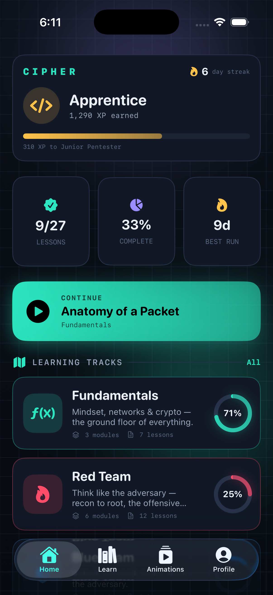
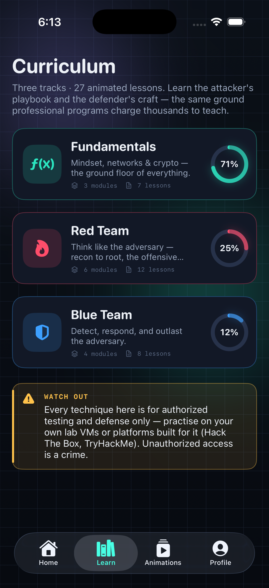
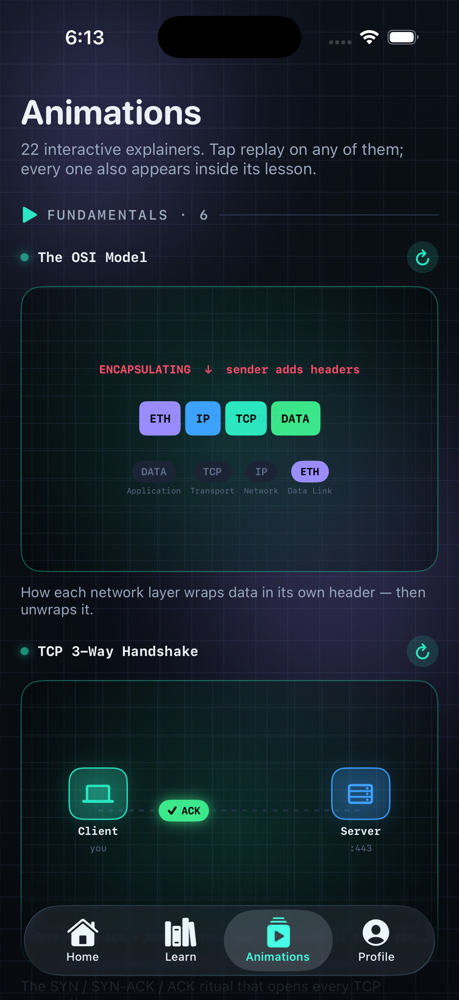
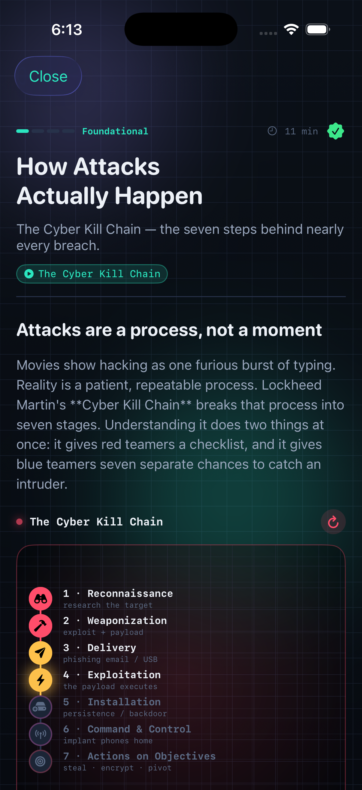
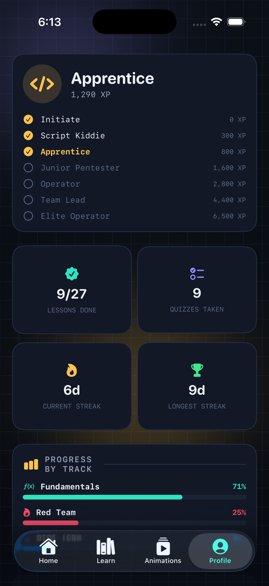
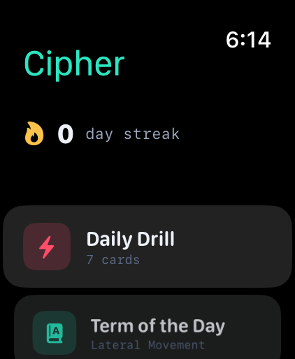

<div align="center">

# Cipher

### 🛡️ Red & Blue Team Academy ⚔️

**A complete, animated cybersecurity course in your pocket — and on your wrist.**

Learn both sides of the craft: the **attacker's playbook** (recon → root) and the
**defender's craft** (detect → respond → outlast), taught through hand-built SwiftUI
animations you can play, pause and scrub, simulated terminals, and scored quizzes.
The same ground professional programs charge thousands for — framed throughout as
**ethical, authorized** security education.

<br>


</div>

---

## Screenshots

| Home | Curriculum | Animations | Lesson | Profile | Watch |
|:----:|:----------:|:----------:|:------:|:-------:|:-----:|
|  |  |  |  |  |  |

---

## ✨ What's inside

| | |
|---|---|
| 📚 **3 tracks · 18 modules · 43 lessons** | Real, accurate, opinionated content modelled on professional curricula (OSCP/OSWE/OSEP/OSED/OSWP) — not placeholders. |
| 🎬 **35 interactive animated explainers** | Every one **plays, pauses, scrubs and changes speed** — freeze an attack mid-step and drag through it frame by frame. |
| 💻 **Simulated terminals** | Type out real commands (`nmap`, `hashcat`, `secretsdump`, `responder`, `bloodhound-python`…) and print output line by line, like a live shell. |
| 🧠 **Quizzes & knowledge checks** | Scored, explained, and physical — haptics, a shake on a wrong answer, a pop on a right one, and a confetti burst when you pass. |
| 🏆 **Progress system** | XP, a 7-tier rank ladder (Initiate → Elite Operator), per-track completion rings, and a daily streak. |
| 📖 **Built for the phone** | A reading-progress bar on every lesson, an **Up next** hand-off that chains lesson → lesson, and rich inline-formatted prose. |
| ⌚ **Apple Watch companion** | A seeded daily flashcard drill, a "term of the day", and your streak/rank — sharing the same curriculum engine. |
| 📖 **82-term searchable glossary** | Every key concept, one tap away. |
| ⚖️ **Ethics first** | A first-launch authorization pledge and reminders that everything here is for systems you own or are authorized to test. |

---

## 🎬 The animations are interactive

This isn't a slideshow. Every explainer is a live SwiftUI animation wrapped in a
transport bar:

- **▶ / ⏸ Play & pause** — or just tap the stage to freeze it.
- **⟷ Scrub** — drag the glowing timeline to move through the loop at your own
  pace. Stop on the exact moment a buffer overwrites the return address, or step
  the TCP handshake one packet at a time.
- **½× · 1× · 2× speed** — slow a dense sequence down, or speed a long one up.
- **↻ Replay** — re-seed from the start.

Built from a handful of reusable engines — `FlowStage` (node-to-node messaging),
`SequenceStage` (staged reveals), `CycleStage` (looping rings), `LadderStage`
(privilege climb) — so the whole library shares one consistent, controllable feel.

---

## 🗺️ Curriculum

### 🟩 Fundamentals — *mindset, the shell, networks, crypto, the web & Windows*
- **Mindset & Ethics** — Hacking, Ethically (CIA triad, RoE) · How Attacks Actually Happen (the Cyber Kill Chain)
- **Systems & the Shell** — Linux & the Command Line
- **Networking for Hackers** — The OSI & TCP/IP Models · TCP, Ports & the 3-Way Handshake · Anatomy of a Packet
- **Cryptography Essentials** — Symmetric & Public-Key Encryption · Hashing, Salting & Leaked Passwords
- **How the Web Works** — HTTP, Cookies & Sessions *(new)*
- **Windows & Active Directory** — Active Directory Foundations *(new)*

### 🟥 Red Team — *think like the adversary*
- **Reconnaissance** — Passive Recon & OSINT · Active Scanning & Enumeration
- **Initial Access & Exploitation** — Phishing & Social Engineering · Exploiting Services & Getting a Shell
- **Web Application Attacks** — SQL Injection · Cross-Site Scripting (XSS) · Command Injection & SSRF · Broken Access Control & IDOR *(new)* · Path Traversal & File Inclusion *(new)* · SSTI, XXE & Insecure Deserialization *(new)*
- **Post-Exploitation** — Privilege Escalation · Password Attacks & Cracking
- **Active Directory & Lateral Movement** — Kerberoasting · AS-REP Roasting, DCSync & Golden Tickets *(new)* · Attack Paths & ACL Abuse *(new)* · Pivoting & Lateral Movement
- **Evasion & Defense Bypass** *(new)* — Antivirus, AMSI & EDR Evasion · Process Injection & Living Off the Land
- **Wireless & Network Attacks** *(new)* — Wi-Fi Attacks: WPA2 & Evil Twin · Network Poisoning & MITM
- **Advanced Exploitation & C2** — Stack Buffer Overflows · Defeating Mitigations: DEP, ASLR & ROP *(new)* · Command & Control

### 🟦 Blue Team — *detect, respond, outlast*
- **Defensive Foundations** — Defense in Depth & the SOC · Network Security & Firewalls · Defending Active Directory *(new)* · Logging, Telemetry & the SIEM
- **Detection Engineering** — MITRE ATT&CK for Defenders · Detection Engineering
- **Threat Hunting & Incident Response** — Threat Hunting · Incident Response Lifecycle
- **Forensics & Malware** — Digital Forensics Essentials · Intro to Malware Analysis

<details>
<summary><b>The 35 animated explainers</b></summary>

<br>

`OSI Model` · `TCP Handshake` · `Anatomy of a Packet` · `Symmetric Encryption` ·
`Public-Key Exchange` · `Hashing` · `An HTTP Request` · `Active Directory Forest` ·
`Cyber Kill Chain` · `Port Scanning` · `Phishing → Initial Access` · `SQL Injection` ·
`Cross-Site Scripting` · `Broken Access Control (IDOR)` · `Path Traversal & File Inclusion` ·
`Server-Side Template Injection` · `Privilege Escalation` · `Password Cracking` ·
`Kerberoasting` · `DCSync → Golden Ticket` · `Attack Path (BloodHound)` ·
`Lateral Movement` · `AMSI Bypass` · `Process Injection` · `WPA2 Handshake Capture` ·
`ARP Poisoning (MITM)` · `Buffer Overflow` · `Return-Oriented Programming` · `C2 Beacon` ·
`Defense in Depth` · `SIEM Pipeline` · `Incident Response Lifecycle` · `MITRE ATT&CK` ·
`Threat Hunting` · `Tiered AD Administration`

</details>

---

## 🛠️ Build & run

Requires **Xcode 16+** and **[XcodeGen](https://github.com/yonyz/XcodeGen)** to
generate the project from `project.yml`.

```bash
brew install xcodegen        # one time
cd Cipher
xcodegen generate            # builds Cipher.xcodeproj from project.yml
open Cipher.xcodeproj
```

> `Cipher.xcodeproj` is committed, so you can skip straight to `open` if you don't
> add files. **Re-run `xcodegen generate` whenever you add or remove source
> files** — the project lists sources explicitly.

**First run:** if Xcode reports *"Signing requires a development team"* or an
`actool` asset error, point your toolchain at the full Xcode (not just the Command
Line Tools) once:

```bash
sudo xcode-select -s /Applications/Xcode.app/Contents/Developer
```

The signing team is set in `project.yml`, so it survives every regeneration.

### Run the iPhone app
1. Pick an **iPhone** simulator in Xcode's toolbar and press **⌘R**.
2. On first launch you'll accept the ethics pledge, then land on the dashboard.

### Run the Apple Watch app
1. Switch the scheme to **Cipher Watch App** (it's also embedded in the iPhone
   app, so installing on a paired device installs both).
2. Pick an **Apple Watch** simulator and press **⌘R**.
   - No watch simulators? Install a runtime via **Xcode ▸ Settings ▸ Components ▸ watchOS**.

### Command-line build check
```bash
DEVELOPER_DIR=/Applications/Xcode.app/Contents/Developer \
xcodebuild -project Cipher.xcodeproj -scheme Cipher \
  -destination 'generic/platform=iOS Simulator' build
```
Both the `Cipher` (iOS) and `Cipher Watch App` (watchOS) schemes build clean.

---

## 🧩 Project layout

```
Cipher/
├─ project.yml                  # XcodeGen: two app targets + shared sources
├─ Cipher.xcodeproj
├─ Screenshots/
├─ Shared/                      # compiles into BOTH iOS + watchOS (pure SwiftUI)
│  ├─ Models/
│  │  ├─ Curriculum.swift         # Track / Module / Lesson / LessonBlock / Quiz / AnimationID
│  │  └─ Progress.swift           # ProgressStore: XP, ranks, streak (UserDefaults)
│  ├─ DesignSystem/Theme.swift    # palette, gradients, type
│  └─ Content/
│     ├─ FundamentalsContent.swift
│     ├─ RedTeamContent.swift
│     ├─ BlueTeamContent.swift
│     └─ Flashcards.swift         # glossary + watch drill deck
├─ CipheriOS/                   # iPhone app
│  ├─ CipherApp.swift             # @main, ethics gate → RootView
│  ├─ Screens/                    # Dashboard, Tracks, TrackDetail, Lesson, Quiz, Gallery, Glossary, Profile, Ethics
│  ├─ Animations/                 # the 22 explainers + reusable engines + playback model + registry
│  ├─ Components/                 # terminal, callouts, code, rings, confetti, cards
│  └─ Assets.xcassets
└─ CipherWatch/                 # Apple Watch app
   ├─ CipherWatchApp.swift
   ├─ WatchRootView.swift
   ├─ Screens/                    # DailyDrill, TermOfDay, Progress
   └─ Assets.xcassets
```

### How it's architected
- **The curriculum is data.** A `Lesson` is an ordered list of `LessonBlock`
  cases (`.heading`, `.paragraph`, `.terminal`, `.callout`, `.animation`,
  `.checkpoint`…). The lesson player just maps over them — adding content never
  touches UI code.
- **The animation engine** wraps a few reusable stages and bespoke views in a
  common `AnimatedExplainer` chrome. A shared `StagePlayback` model gives every
  stage play/pause, speed and scrubbing for free, and `AnimationRegistry`
  resolves each `AnimationID` to its view.
- **The `Shared` folder is strictly cross-platform** (SwiftUI + Foundation, no
  UIKit) so the iPhone and Watch apps share the same models, content, theme and
  progress store.

### Extending it
- **Add a lesson:** append a `Lesson` to a `Module` in the relevant
  `*Content.swift`. It appears automatically in the dashboard, track detail,
  progress and search.
- **Add an animation:** add a case to `AnimationID`, build its view (on the shared
  engines or from scratch), and wire it in `AnimationRegistry`. Reference it from
  any lesson with `.animation(.yourID, caption: "…")` — it inherits the full
  transport bar automatically.

---

## ⚖️ A note on ethics & the law

Cipher teaches offensive techniques **so you can defend, and test with
authorization.** Practise only on systems you own or have explicit written
permission to assess — your own lab VMs, or platforms built for it like
[Hack The Box](https://www.hackthebox.com) and [TryHackMe](https://tryhackme.com).
Unauthorized access to computer systems is a crime in nearly every country
(US CFAA, UK Computer Misuse Act, and equivalents). The skill being legal does not
make the act legal — **authorization does.**

---

<div align="center">

*Built with SwiftUI · iOS 17+ / watchOS 10+ · no dependencies, fully offline.*

</div>
