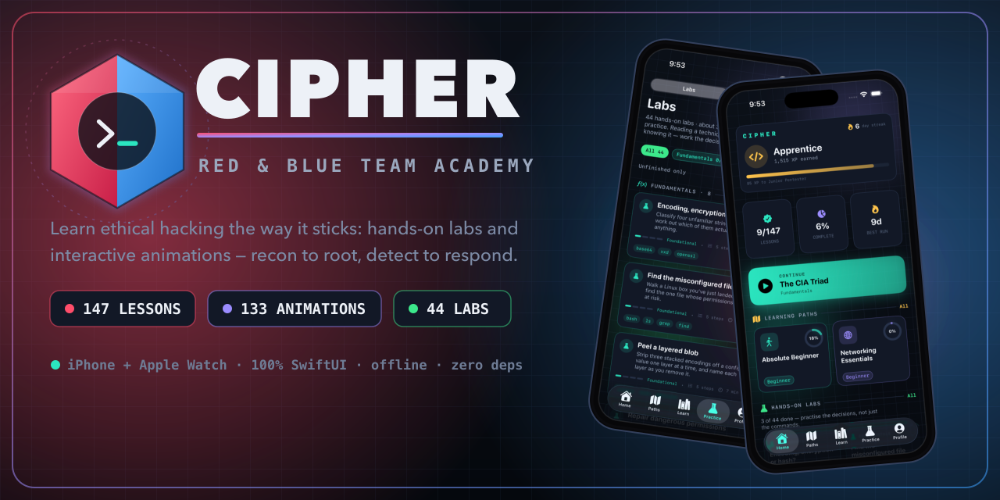
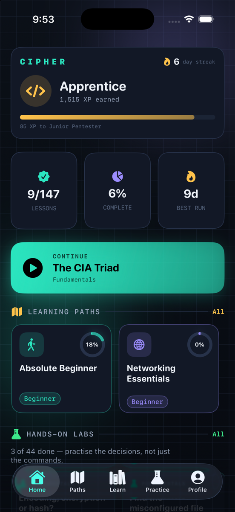
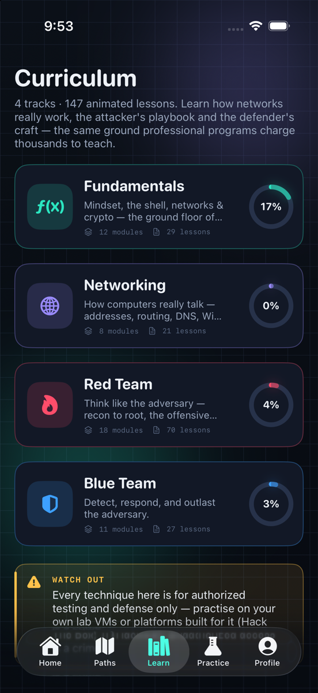
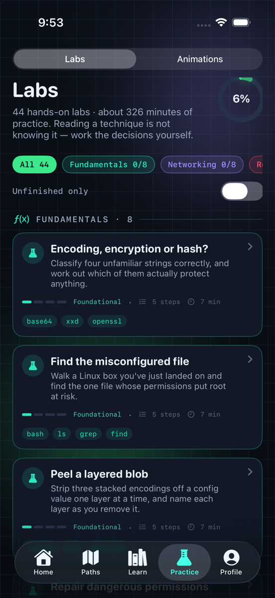
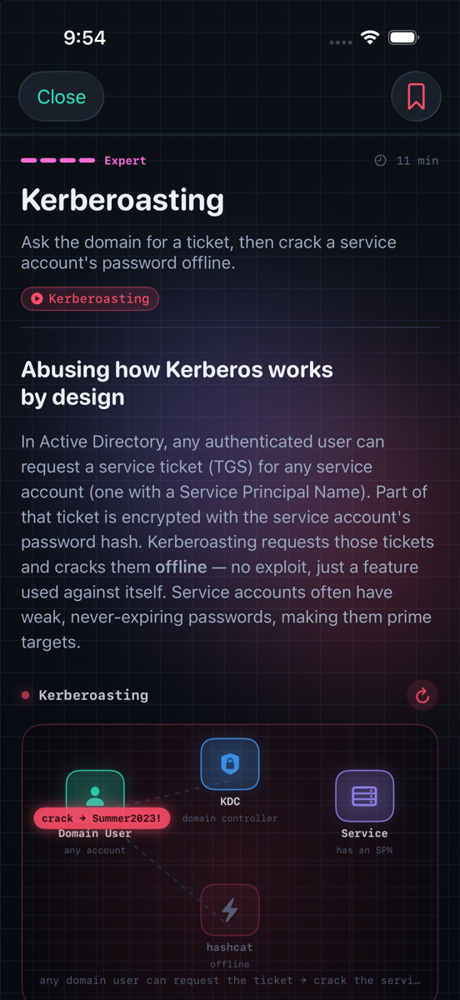
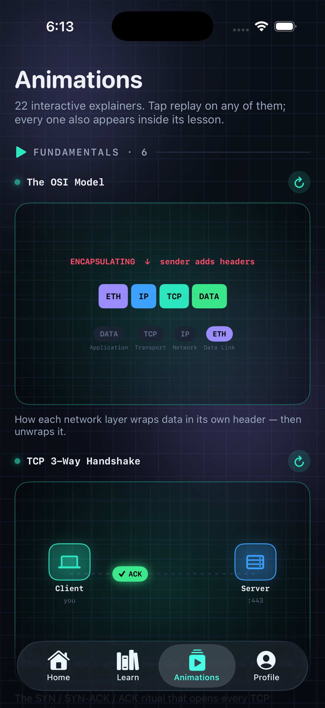
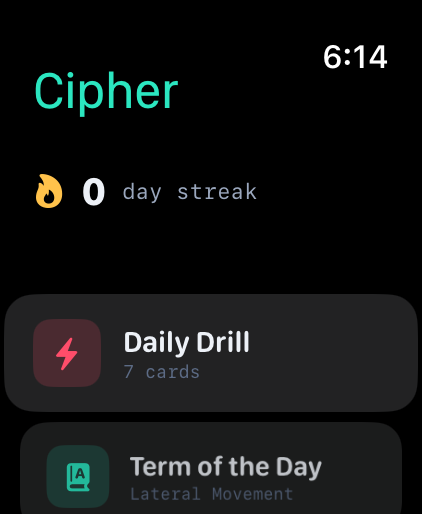

<div align="center">



# Cipher

### 🛡️ Red & Blue Team Academy ⚔️

**A complete, animated cybersecurity course in your pocket — and on your wrist.**

Learn both sides of the craft: the **attacker's playbook** (recon → root) and the
**defender's craft** (detect → respond → outlast), taught through hand-built SwiftUI
animations you can play, pause and scrub, simulated terminals, hands-on decision
labs, and scored quizzes. The same ground professional programs charge thousands
for — framed throughout as **ethical, authorized** security education.

<br>


<!-- BEGIN:STATS -->


<!-- END:STATS -->

</div>

---

## Screenshots

| Home | Curriculum | Labs | Lesson | Animations | Watch |
|:----:|:----------:|:----:|:------:|:----------:|:-----:|
|  |  |  |  |  |  |

---

## ✨ What's inside

<!-- BEGIN:SUMMARY -->
| | |
|---|---|
| **4 tracks · 49 modules · 147 lessons** | About **25 hours** of written material, modelled on professional curricula (OSCP/OSWA/OSWE/OSEP/OSED/OSEE/OSWP) and extended with cloud, container, API, mobile, AI and modern-defence topics. |
| **44 hands-on labs** | Tap-to-play decision labs with a simulated terminal, browsable in the **Practice** tab, filterable by track and difficulty. |
| **133 animated explainers** | Every one plays, pauses, **scrubs** and changes speed. |

<!-- END:SUMMARY -->

| | |
|---|---|
| 🧭 **Learning paths** | Goal-oriented routes through the curriculum — *Absolute Beginner*, *Web App Hacker*, *SOC Analyst*, *AD Attacker*, *Cloud Security* and more — so you never have to guess what to read next. |
| 💻 **Simulated terminals** | Real commands (`nmap`, `hashcat`, `secretsdump`, `responder`, `getST`, `ROPgadget`, `proxychains`…) printing output line by line, like a live shell. |
| 🧠 **Quizzes & knowledge checks** | Scored, explained, and physical — haptics, a shake on a wrong answer, a pop on a right one, confetti when you pass. |
| 🏆 **Progress system** | XP, a 7-tier rank ladder (Initiate → Elite Operator), per-track completion rings, finished-lab tracking and a daily streak. |
| 🔖 **Bookmarks** | Save any lesson to a "Saved" list for later. |
| ⌚ **Apple Watch companion** | A seeded daily flashcard drill, a "term of the day", and your streak/rank — sharing the same curriculum engine. |
| 📖 **Searchable glossary** | Every key concept, one tap away, filterable by track. |
| ⚖️ **Ethics first** | A first-launch authorization pledge and reminders throughout that everything here is for systems you own or are authorized to test. |
| 🔌 **No network, no accounts, no dependencies** | The app makes zero network requests. Your progress never leaves your device. |

---

## 🧪 Hands-on labs

Reading a technique is not knowing it. Cipher's labs are **tap-to-play decision
exercises**: you are handed a scenario, and at each step you pick the command or
the call you would actually make. The right choice runs in a simulated terminal
that accumulates as you go; a wrong one explains *why the reasoning fails* and
lets you try again. Every lab ends with a debrief that flips perspective — a red
lab tells you how a defender catches it, a blue lab tells you what the attacker
wanted.

They live in the **Practice** tab, filterable by track and difficulty, with a
hint on every step for when you are stuck.

<details>
<summary><b>Every lab</b></summary>

<br>

<!-- BEGIN:LABS -->
| Lab | Track | Level | Steps |
|---|---|---|---|
| **Encoding, encryption or hash?** — Classify four unfamiliar strings correctly, and work out which of them actually protect anything. | Fundamentals | Foundational | 5 |
| **Find the misconfigured file** — Walk a Linux box you've just landed on and find the one file whose permissions put root at risk. | Fundamentals | Foundational | 5 |
| **Peel a layered blob** — Strip three stacked encodings off a config value one layer at a time, and name each layer as you remove it. | Fundamentals | Foundational | 5 |
| **Repair dangerous permissions** — Audit a web directory on your own lab VM and fix a world-writable secret, a world-writable directory and a stray SUID binary. | Fundamentals | Foundational | 5 |
| **Crack a hash, then meet a salt** — Recover passwords from an unsalted MD5 dump, then work out precisely what a salt takes away from you. | Fundamentals | Intermediate | 5 |
| **Grep the signal out of a log** — Write patterns precise enough to answer four questions about a 2 GB access log, and spot the one regex that is a denial-of-service bug. | Fundamentals | Intermediate | 5 |
| **The extension is lying** — Identify a file's real type from its bytes when its name says something else, and name the upload flaw that let it in. | Fundamentals | Intermediate | 5 |
| **Should you trust this certificate?** — Diagnose three different certificate failures, decide what each one actually means, and name the risk you take on when you trust a new root. | Fundamentals | Advanced | 5 |
| **Bisect a Dead Connection** — Walk the stack bottom-up — link, address, neighbour, route, name — and find the one broken rung. | Networking | Foundational | 7 |
| **Prove a Host Is Not on Your Subnet** — Size a subnet to a stated requirement, then prove from the host's own stack whether a second address is on-link. | Networking | Foundational | 6 |
| **DNS Triage: Resolver, Record or Propagation** — Separate a caching problem from a zone-content problem from a zone-transfer problem — without flushing the evidence. | Networking | Intermediate | 7 |
| **Find the Break in a Traceroute** — Read a traceroute correctly — tell a silent hop from a broken path, and a probe problem from an outage. | Networking | Intermediate | 5 |
| **Read a Capture, Name the Failing Layer** — Use a packet excerpt to say which layers are proven healthy and which is the lowest one still failing. | Networking | Intermediate | 5 |
| **Wi-Fi: Association Versus Lease** — Separate the radio link from the DHCP exchange, and read each one's own evidence instead of guessing. | Networking | Intermediate | 6 |
| **NAT Problem or Routing Problem?** — Use rule counters and a two-sided capture to tell a translation failure from a missing return path. | Networking | Advanced | 6 |
| **Why the Firewall Rule Is Not Matching** — Use counters and chain order to find out why a correct-looking rule never sees the traffic it was written for. | Networking | Advanced | 6 |
| **Survive a vishing call** — You're an employee. A caller is trying to social-engineer you — don't get played. | Red Team | Foundational | 3 |
| **Turn reflected XSS into a stolen session** — Prove a search box runs your JavaScript, then show it can lift a session cookie — on your own lab app. | Red Team | Foundational | 4 |
| **Walk an IDOR to someone else's data** — Read another customer's invoice on the practice portal without touching an exploit. | Red Team | Foundational | 4 |
| **Bypass a login with SQLi** — Log in as admin without knowing the password. | Red Team | Intermediate | 3 |
| **Enumerate a target with nmap** — Find the open ports on 10.10.10.5, then identify an exploitable service. | Red Team | Intermediate | 3 |
| **Pivot an SSRF into cloud credentials** — Use a URL-fetch feature on your lab app to reach the instance metadata service and surface IAM creds. | Red Team | Intermediate | 4 |
| **Root a Linux box with a SUID GTFOBin** — Escalate from a www-data shell to root on your lab VM by abusing a misconfigured binary. | Red Team | Intermediate | 4 |
| **Slip a web shell past an upload filter** — Land executable code via an avatar upload on your lab app and get command execution. | Red Team | Intermediate | 4 |
| **AS-REP roast a pre-auth-disabled account** — Recover a domain account's password offline by abusing missing Kerberos pre-authentication. | Red Team | Advanced | 4 |
| **Forge an admin JWT** — Promote yourself to admin by defeating a JWT's signature check on your lab API. | Red Team | Advanced | 4 |
| **Pivot into a hidden subnet over SOCKS** — Reach an internal-only host through a compromised pivot without being reckless or loud. | Red Team | Advanced | 4 |
| **Service account to SYSTEM via SeImpersonate** — Escalate from a web-service shell to NT AUTHORITY\\SYSTEM on your Windows lab host. | Red Team | Advanced | 4 |
| **Spray without locking the client out** — Find one valid credential on the client's SSO without tripping a single account lockout. | Red Team | Advanced | 4 |
| **Kerberoast a service account to Domain Admin** — Crack an over-privileged service account's password offline, quietly, from a single domain user. | Red Team | Expert | 4 |
| **Shape a C2 beacon to hide in the noise** — Configure an implant on your lab range to blend into normal web traffic instead of being obvious. | Red Team | Expert | 4 |
| **Acquire the evidence in the right order** — Collect what you need from a live compromised workstation before the act of responding destroys it. | Blue Team | Foundational | 5 |
| **Call the verdict on a mail header** — Decide whether a message claiming to come from your own domain is authentic — and justify the call. | Blue Team | Foundational | 5 |
| **Contain an account compromise** — Cut an attacker out of a cloud identity completely — not just out of the password. | Blue Team | Intermediate | 5 |
| **Map the behaviour to ATT&CK** — Turn three raw observations into the right techniques — specific enough to measure coverage against. | Blue Team | Intermediate | 5 |
| **Stand down a false positive** — Work an intel-match alert to a defensible not-an-incident verdict, and make it stop recurring. | Blue Team | Intermediate | 5 |
| **Triage the auth log** — Read the log, find the compromise, and take the right first response. | Blue Team | Intermediate | 3 |
| **Write the detection that catches it** — Build a Sigma rule for shadow-copy destruction that fires on the technique and not on your backup team. | Blue Team | Intermediate | 5 |
| **Find the exfil in the Zeek logs** — Separate DNS tunnelling from DGA and from noise, then cut the channel without blinding yourself. | Blue Team | Advanced | 5 |
| **Hunt a beacon from one weak signal** — Turn a timing oddity into a scoped intrusion, then make the isolate-or-observe call correctly. | Blue Team | Advanced | 6 |
| **Static-triage an unknown binary** — Decide what a sample does and how urgent it is, without detonating it and without leaking it. | Blue Team | Advanced | 6 |
| **Tune a noisy rule without going blind** — Cut 1,400 weekly alerts down to signal while keeping the detection able to catch the technique. | Blue Team | Advanced | 5 |
| **Build a timeline the attacker tried to break** — Establish when a compromise really began, through cleared logs and forged timestamps. | Blue Team | Expert | 6 |
| **The first hour of a ransomware detonation** — Sequence containment, evidence, backups and notification correctly while the encryption is still running. | Blue Team | Expert | 6 |
<!-- END:LABS -->

</details>

> **Want labs you can actually `docker compose up`?** The companion
> **[CipherLabs](https://github.com/at0m-b0mb/CipherLabs)** repo ships SEED-style
> containerized vulnerable environments — real targets, real tools, real packet
> captures — to run alongside the course on your own machine.

---

## 🎬 The animations are interactive

This isn't a slideshow. Every explainer is a live SwiftUI animation wrapped in a
transport bar:

- **▶ / ⏸ Play & pause** — or just tap the stage to freeze it.
- **⟷ Scrub** — drag the glowing timeline to move through the loop at your own
  pace. Stop on the exact moment a buffer overwrites the return address, or step
  the TCP handshake one packet at a time.
- **½× · 1× · 2× speed** — slow a dense sequence down, or speed a long one up.
- **↻ Replay** — re-seed from the start.

Built from a handful of reusable engines — `FlowStage` (node-to-node messaging),
`SequenceStage` (staged reveals), `CycleStage` (looping rings), `LadderStage`
(privilege climb) — so the whole library shares one consistent, controllable feel.

The gallery is **derived** from the animation registry, so every explainer in the
app is browsable there; none can go missing.

<details>
<summary><b>Every animated explainer</b></summary>

<br>

<!-- BEGIN:ANIMATIONS -->
`The OSI Model` · `TCP 3-Way Handshake` · `Anatomy of a Packet` · `Encoding Layers` · `A Network of Networks` · `IP & MAC Addresses` · `Subnet Mask & CIDR` · `DNS Lookup` · `Switch, Router & Gateway` · `Routing & Traceroute` · `NAT Translation` · `DHCP Lease (DORA)` · `TCP vs UDP` · `Joining a Wi-Fi Network` · `VPN Tunnel` · `Firewall Filtering` · `Processes & Memory Layout` · `Certificate Chain (PKI)` · `Staged Payload → Meterpreter` · `Windows Token Theft` · `IDS Signature & Anomaly` · `Secure SDLC Pipeline` · `Reverse Engineering a Binary` · `Padding Oracle Attack` · `DNS Tunneling Exfiltration` · `Dependency Confusion` · `Adversary-in-the-Middle` · `LLM Prompt Injection` · `Clickjacking (UI Redress)` · `Web Cache Poisoning` · `Bluetooth / BLE Replay` · `RFID / NFC Cloning` · `DDoS Amplification` · `LSB Steganography` · `TLS 1.3 Handshake` · `IPv6 Address Anatomy` · `Load Balancing & CDN` · `Password Spraying` · `NoSQL Injection` · `The Purple-Team Loop` · `STRIDE Threat Modeling` · `XOR & Bitwise Logic` · `SQL SELECT Scan` · `Regex Matching` · `BGP Route Selection` · `Email Delivery (SMTP)` · `QUIC vs TCP+TLS` · `AD CS Abuse (ESC1)` · `Server-Side Request Forgery` · `Ransomware & Recovery` · `Multi-Factor Authentication` · `VMs vs Containers` · `Forward & Reverse Proxies` · `WebSocket Upgrade` · `CORS Misconfiguration` · `Public Bucket Exposure` · `SOAR Auto-Response` · `Secrets Management` · `Source to CPU` · `Randomness & Entropy` · `VLAN Tagging` · `BadUSB Injection` · `DLL Hijacking` · `NIST CSF Functions` · `Risk Matrix` · `YARA Rule Matching` · `The CIA Triad` · `Threat Actors` · `Social Engineering` · `Log Analysis` · `Number Bases` · `Endianness` · `Character Encoding` · `Linux Permissions` · `Bitwise Logic Gates` · `Salted Hashing` · `Symmetric Encryption` · `Public-Key Exchange` · `Hashing` · `Block Cipher Modes (ECB)` · `An HTTP Request` · `Active Directory Forest` · `The Cyber Kill Chain` · `Port Scanning` · `Phishing → Initial Access` · `SQL Injection` · `Cross-Site Scripting` · `Broken Access Control (IDOR)` · `Path Traversal & File Inclusion` · `Server-Side Template Injection` · `Cross-Site Request Forgery` · `JWT Token Attacks` · `API & GraphQL (BOLA)` · `OAuth Token Theft` · `Source-to-Sink (White-Box)` · `Client-Side Attack` · `Cloud Metadata SSRF` · `Container Escape` · `Subdomain Takeover` · `HTTP Request Smuggling` · `Race Condition (TOCTOU)` · `Insecure File Upload` · `Mobile App Attack` · `Privilege Escalation` · `Offline Password Cracking` · `Kerberoasting` · `DCSync → Golden Ticket` · `Attack Path (BloodHound)` · `Kerberos Delegation Abuse` · `Forest Trust Abuse` · `Lateral Movement` · `Tunneling & Pivoting` · `AMSI Bypass` · `Process Injection` · `AppLocker Bypass` · `WPA2 Handshake Capture` · `ARP Poisoning (MITM)` · `Stack Buffer Overflow` · `Return-Oriented Programming` · `SEH Overflow` · `Format String Exploit` · `Heap Exploitation` · `Command & Control Beacon` · `Defense in Depth` · `SIEM Detection Pipeline` · `Incident Response Lifecycle` · `MITRE ATT&CK` · `Threat Hunting Loop` · `Tiered AD Administration` · `Threat Intelligence Cycle` · `Zero Trust Decision` · `Email Auth (SPF/DKIM/DMARC)` · `Honeypots & Canary Tokens`
<!-- END:ANIMATIONS -->

</details>

---

## 🗺️ Curriculum

<!-- BEGIN:CURRICULUM -->
### 🟩 Fundamentals — *Mindset, the shell, networks & crypto — the ground floor of everything.*

<sub>12 modules · 29 lessons</sub>

- **Mindset & Ethics** — Hacking, Ethically · How Attacks Actually Happen
- **Core Security Concepts** — The CIA Triad · Threat Actors & Motivations · How to Learn Cyber: Your Roadmap
- **Systems & the Shell** — Linux & the Command Line · Linux Permissions & Ownership
- **How Programs Run** — Processes, Memory & the OS
- **Networking for Hackers** — The OSI & TCP/IP Models · TCP, Ports & the 3-Way Handshake · Anatomy of a Packet
- **Data & Encoding** — Bytes, Hex, Base64 & Encoding · Characters: ASCII, Unicode & UTF-8 · Steganography & Data Hiding
- **Cryptography Essentials** — Symmetric & Public-Key Encryption · Block Cipher Modes & Their Pitfalls · Hashing, Salting & Leaked Passwords · PKI, Certificates & TLS Trust
- **How the Web Works** — HTTP, Cookies & Sessions · How HTTPS Works: TLS
- **Windows & Active Directory** — Active Directory Foundations
- **Code & Data** — Number Systems: Binary, Decimal & Hex · Bits, Bytes & XOR · Databases & SQL · Regular Expressions
- **Identity & Isolation** — Authentication & MFA · Virtual Machines & Containers
- **Inside the Machine** — How Code Runs: Source to CPU · Randomness & Entropy

### 🟪 Networking — *How computers really talk — addresses, routing, DNS, Wi-Fi and the protocols that run the internet.*

<sub>8 modules · 21 lessons</sub>

- **Networking Foundations** — What Is a Network? · Packets & Layers
- **Addresses & Names** — IP & MAC Addresses · Subnets, Masks & CIDR · DNS — The Internet's Phonebook
- **Moving Data Across Networks** — Switches, Routers & the Default Gateway · Routing & Traceroute · NAT — Sharing One Public IP · DHCP — Getting an Address Automatically · VLANs & Segmentation
- **Protocols You Use Daily** — TCP vs UDP · The Protocols Behind the Apps
- **Wireless & Network Security** — Wi-Fi & Wireless Networks · Firewalls & VPNs
- **The Modern Internet** — IPv6 & the Address Crunch · Load Balancers, CDNs & Anycast · QUIC & HTTP/3
- **Internet Infrastructure** — BGP & How the Internet Routes · How Email Travels
- **Web & Real-Time** — Proxies & Reverse Proxies · WebSockets & Real-Time Web

### 🟥 Red Team — *Think like the adversary — recon to root, the offensive way.*

<sub>18 modules · 70 lessons</sub>

- **Reconnaissance** — Passive Recon & OSINT · Active Scanning & Enumeration
- **Initial Access & Exploitation** — Phishing & Social Engineering · Social Engineering · Password Spraying & Credential Stuffing · Client-Side Attacks · Physical Access & BadUSB · Exploiting Services & Getting a Shell
- **Exploitation Frameworks** — Metasploit, Payloads & Meterpreter
- **Web Application Attacks** — SQL Injection · NoSQL Injection · Cross-Site Scripting (XSS) · Command Injection & SSRF · Server-Side Request Forgery · Broken Access Control & IDOR · CORS Misconfiguration · Path Traversal & File Inclusion · Insecure File Uploads → Web Shell · SSTI, XXE & Insecure Deserialization · Cross-Site Request Forgery (CSRF) · Clickjacking & UI Redress · JWT & Token Attacks · API & GraphQL Attacks · OAuth, SSO & Token Theft · Subdomain Takeover & DNS Attacks · HTTP Request Smuggling · Web Cache Poisoning · Race Conditions & TOCTOU · White-Box: Source Code Review
- **Post-Exploitation** — Privilege Escalation · Password Attacks & Cracking · Tunneling & Port Forwarding
- **Privilege Escalation Deep Dive** — Linux Privilege Escalation · Windows Privilege Escalation
- **Active Directory & Lateral Movement** — Kerberoasting · AS-REP Roasting, DCSync & Golden Tickets · Attack Paths & ACL Abuse · Pivoting & Lateral Movement
- **Advanced Active Directory** — Kerberos Delegation Abuse · Domain & Forest Trust Attacks · AD CS Abuse (ESC1)
- **Cloud & Container Attacks** — Attacking Cloud Infrastructure · Cloud Storage Exposure · Container & Kubernetes Breakouts
- **Mobile App Attacks** — Attacking Mobile Applications
- **Evasion & Defense Bypass** — Antivirus, AMSI & EDR Evasion · Process Injection & Living Off the Land · Application Whitelisting Bypass · DLL Search-Order Hijacking
- **Wireless & Network Attacks** — Wi-Fi Attacks: WPA2 & Evil Twin · Network Poisoning & MITM · Bluetooth & BLE Attacks · RFID, NFC & Physical Access · DoS, DDoS & Amplification
- **Covert Channels & Supply Chain** — Data Exfiltration & DNS Tunneling · Supply Chain Attacks
- **Reverse Engineering & Crypto Attacks** — Reverse Engineering & Debugging · Attacking Cryptography
- **Advanced Exploitation & C2** — Stack Buffer Overflows · Defeating Mitigations: DEP, ASLR & ROP · Command & Control (C2)
- **Binary Exploitation** — SEH Overflows & Egghunters · Format String Vulnerabilities · Heap Exploitation
- **Modern Attack Frontiers** — Adversary-in-the-Middle: Phishing Past MFA · Attacking AI: Prompt Injection
- **The Operator's Field Manual** — Build Your Practice Lab · Methodology & Writing the Report · Bug Bounty: Hunt, Triage & Report · CTF Survival Guide

### 🟦 Blue Team — *Detect, respond, and outlast the adversary.*

<sub>11 modules · 27 lessons</sub>

- **Defensive Foundations** — Defense in Depth & the SOC · Network Security & Firewalls · Email Authentication: SPF, DKIM & DMARC · Defending Active Directory · Logging, Telemetry & the SIEM
- **Detection Engineering** — MITRE ATT&CK for Defenders · Detection Engineering · YARA Rules · Log Analysis
- **Network Security Monitoring** — IDS, IPS & Network Visibility
- **Threat Hunting & Incident Response** — Threat Hunting · Incident Response Lifecycle
- **Modern Defense** — Cyber Threat Intelligence · Vulnerability Management · Deception: Honeypots & Canary Tokens · Zero Trust Architecture
- **Securing Apps & the Cloud** — Application Security & the Secure SDLC · Cloud Security & Shared Responsibility
- **Forensics & Malware Analysis** — Digital Forensics Essentials · Intro to Malware Analysis
- **Proactive Defense** — Threat Modeling with STRIDE · Purple Teaming
- **Resilience & Recovery** — Ransomware & Recovery
- **Security Operations** — SOC Automation (SOAR) · Secrets Management
- **Governance & Risk** — Security Frameworks (NIST CSF) · Risk Management
<!-- END:CURRICULUM -->

---

## 🛠️ Build & run

Requires **Xcode 16+** and **[XcodeGen](https://github.com/yonaskolb/XcodeGen)** to
generate the project from `project.yml`.

```bash
brew install xcodegen        # one time
cd Cipher
xcodegen generate            # builds Cipher.xcodeproj from project.yml
open Cipher.xcodeproj
```

> `Cipher.xcodeproj` is committed, so you can skip straight to `open` if you don't
> add files. **Re-run `xcodegen generate` whenever you add or remove source
> files** — the project lists its sources explicitly, so a new file is invisible
> to the build until you regenerate. (If Xcode says your brand-new type "cannot
> be found in scope", this is why.)

**First run:** if Xcode reports *"Signing requires a development team"* or an
`actool` asset error, point your toolchain at the full Xcode (not just the Command
Line Tools) once:

```bash
sudo xcode-select -s /Applications/Xcode.app/Contents/Developer
```

### Run the iPhone app
1. Pick an **iPhone** simulator in Xcode's toolbar and press **⌘R**.
2. On first launch you'll accept the ethics pledge, then land on the dashboard.

### Run the Apple Watch app
1. Switch the scheme to **Cipher Watch App** (it's also embedded in the iPhone
   app, so installing on a paired device installs both).
2. Pick an **Apple Watch** simulator and press **⌘R**.
   - No watch simulators? Install a runtime via **Xcode ▸ Settings ▸ Components ▸ watchOS**.

### Command-line build check
```bash
DEVELOPER_DIR=/Applications/Xcode.app/Contents/Developer \
xcodebuild -project Cipher.xcodeproj -scheme Cipher \
  -destination 'generic/platform=iOS Simulator' build
```
Both the `Cipher` (iOS) and `Cipher Watch App` (watchOS) schemes build clean.

### Content checks

The curriculum is hand-authored Swift data, so the compiler happily accepts
content that is *structurally* wrong. Two scripts cover what it cannot:

```bash
python3 scripts/validate-content.py     # ids, lab steps, dangling references
python3 scripts/generate-readme.py      # regenerate this README's data sections
```

`validate-content.py` fails on duplicate ids, a module id colliding with a lesson
id, a lab step with the wrong number of correct answers, a learning path or lab
pointing at a lesson that no longer exists, and an animation that is wired
nowhere. Run it before opening a PR.

---

## 🧩 Project layout

```
Cipher/
├─ project.yml                  # XcodeGen: two app targets + shared sources
├─ Cipher.xcodeproj
├─ scripts/                     # content validator + README generator
├─ branding/                    # social-preview card (SVG source + rendered PNG)
├─ Screenshots/
├─ Shared/                      # compiles into BOTH iOS + watchOS (pure SwiftUI)
│  ├─ Models/
│  │  ├─ Curriculum.swift         # Track / Module / Lesson / LessonBlock / Lab / Quiz / AnimationID
│  │  ├─ LearningPaths.swift      # goal-oriented routes through the curriculum
│  │  └─ Progress.swift           # ProgressStore: XP, ranks, streak, labs, bookmarks
│  ├─ DesignSystem/Theme.swift    # palette, gradients, type
│  └─ Content/
│     ├─ FundamentalsContent.swift
│     ├─ NetworkingContent.swift
│     ├─ RedTeamContent.swift
│     ├─ BlueTeamContent.swift
│     ├─ LabLibrary.swift         # the lab registry (in-lesson + standalone)
│     ├─ Labs{Foundations,Networking,Red,Blue}.swift
│     └─ Flashcards.swift         # glossary + watch drill deck
├─ CipheriOS/                   # iPhone app
│  ├─ CipherApp.swift             # @main, ethics gate → RootView
│  ├─ Screens/                    # Dashboard, Paths, Tracks, Lesson, Practice, Labs, Glossary, Profile
│  ├─ Animations/                 # the explainers + reusable engines + playback model + registry
│  ├─ Components/                 # terminal, interactive lab, callouts, code, rings, confetti
│  └─ Assets.xcassets
└─ CipherWatch/                 # Apple Watch app
   ├─ CipherWatchApp.swift
   ├─ WatchRootView.swift
   └─ Screens/                    # DailyDrill, TermOfDay, Progress
```

### How it's architected

- **The curriculum is data.** A `Lesson` is an ordered list of `LessonBlock`
  cases (`.heading`, `.paragraph`, `.terminal`, `.callout`, `.animation`,
  `.interactiveLab`, `.checkpoint`…). The lesson player just maps over them —
  adding content never touches UI code.
- **Labs are data too, and self-registering.** `Labs.all` unifies labs embedded
  in lessons with the standalone library, so a new lab appears in the Practice
  tab with no UI wiring.
- **The animation engine** wraps reusable stages and bespoke views in a common
  `AnimatedExplainer` chrome. A shared `StagePlayback` model gives every stage
  play/pause, speed and scrubbing for free.
- **The `Shared` folder is strictly cross-platform** (SwiftUI + Foundation, no
  UIKit) so the iPhone and Watch apps share the same models, content, theme and
  progress store.

**Want to add a lesson, a lab or an animation?** See
**[CONTRIBUTING.md](CONTRIBUTING.md)** — it documents each wire-up step and the
gotchas that will otherwise cost you an afternoon.

---

## 🎨 Branding & social preview

The repo ships its own branding card in [`branding/`](branding/):

- **`cipher-social.svg`** — the editable vector source (1280×640).
- **`cipher-social.png`** — the rendered raster, used as the README banner above
  and as the GitHub **social preview**.

To set it as the image people see when the repo is shared: GitHub → repo
**Settings** → **Social preview** → **Edit** → upload `branding/cipher-social.png`.
GitHub only accepts a raster there, which is why the PNG is pre-rendered at the
recommended 1280×640. Re-render after editing the SVG with:

```bash
rsvg-convert -w 1280 -h 640 branding/cipher-social.svg -o branding/cipher-social.png
```

---

## ⚖️ Ethics & the law

Cipher teaches offensive technique **so you can defend, and so you can test with
authorization.** Practise only on systems you own or have explicit written
permission to assess — your own lab VMs, the companion
[CipherLabs](https://github.com/at0m-b0mb/CipherLabs) environments, or platforms
built for it like [Hack The Box](https://www.hackthebox.com),
[TryHackMe](https://tryhackme.com) and
[PortSwigger's Web Security Academy](https://portswigger.net/web-security).

Unauthorized access to computer systems is a crime in nearly every country (US
CFAA, UK Computer Misuse Act, India's IT Act, and equivalents). The skill being
legal does not make the act legal — **authorization does.**

See [SECURITY.md](SECURITY.md) for responsible use and how to report a
vulnerability — or, just as importantly, **a factual error in the content.** A
wrong technical claim is a bug in this project, and in a teaching app it is a
serious one.

---

## 🤝 Contributing

Accuracy fixes and new teaching material are the most valuable contributions this
project can get. Start with **[CONTRIBUTING.md](CONTRIBUTING.md)**.

## 📄 License

[MIT](LICENSE) © 2026 at0m-b0mb

---

<div align="center">

*Built with SwiftUI · iOS 17+ / watchOS 10+ · no dependencies, fully offline.*

</div>
